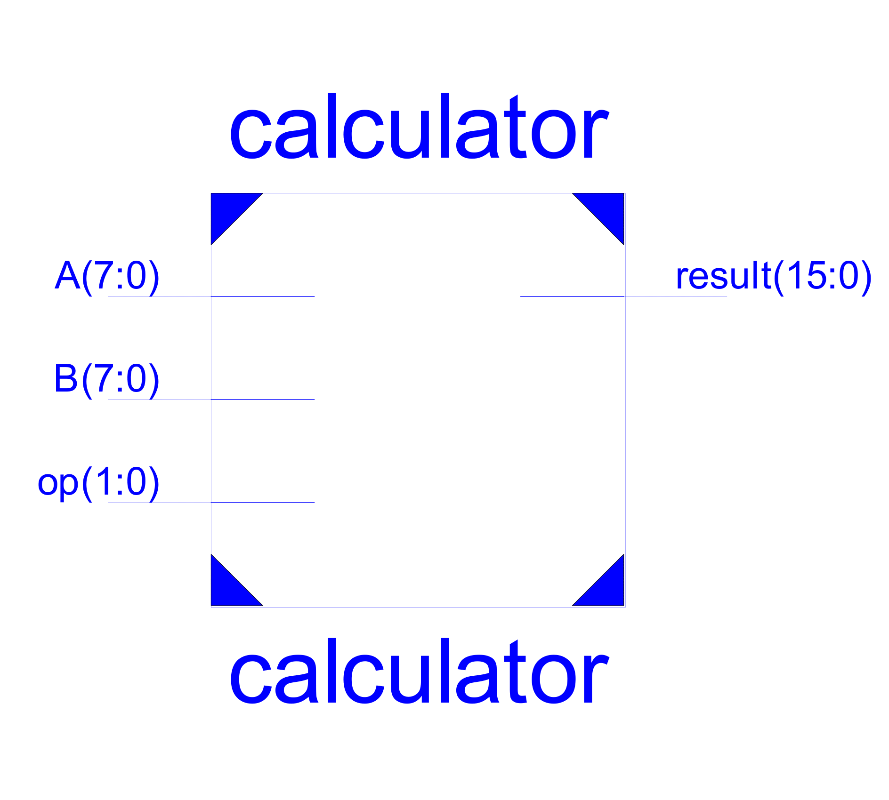
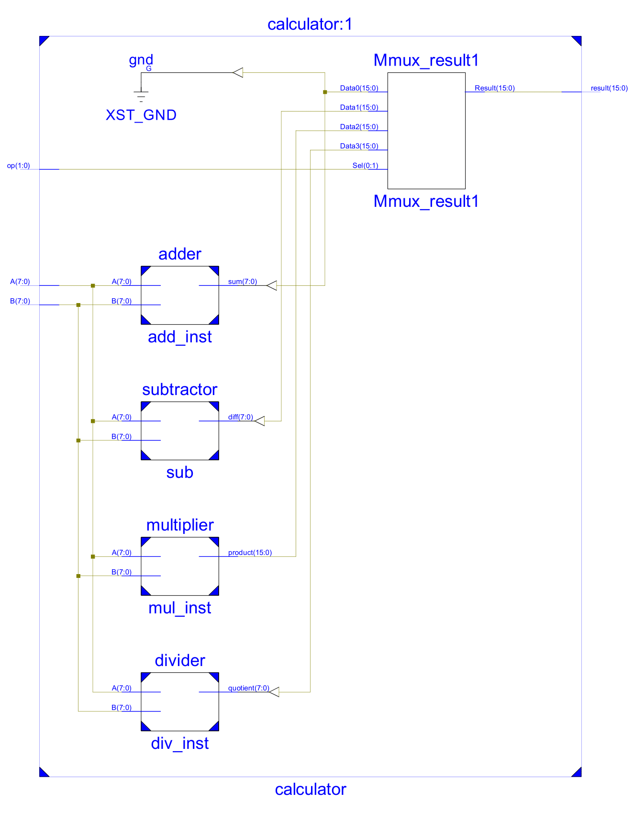
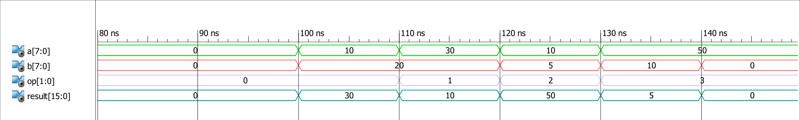

# Simple-VHDL-Calculator

## Overview
This project involves designing a calculator using VHDL that can perform basic arithmetic operations: addition, subtraction, multiplication, and division. The project covers the complete design cycle, including defining the architecture, creating components, implementing the design, and writing a testbench for simulation.

The project was implemented using Xilinx as a training exercise to apply the concepts learned from a VHDL course taken in college.

---

## Features
- **Basic Arithmetic Operations**: Addition, Subtraction, Multiplication, and Division.
- **Top-Level Entity**: A calculator with input and output ports for operands, operation selection, and result output.
- **Component-Based Design**: Separate entities for each arithmetic operation to improve modularity and ease of testing.
- **Simulation and Verification**: A testbench is provided to simulate the functionality of the calculator with different inputs and operations.

---

## Project Structure

1. **Define the Architecture**:
   
   - Create the top-level entity for the calculator, which will have:
     - Input ports: Two operands and one operation selector (`op`).
     - Output ports: The result of the arithmetic operation.
   - The top-level entity acts as a wrapper for the individual operation modules.
   

3. **Component Design**:
   - Design separate entities for each arithmetic operation:
     - **Adder**: Takes two operands and returns their sum.
     - **Subtractor**: Takes two operands and returns the difference.
     - **Multiplier**: Multiplies two operands and returns the product.
     - **Divider**: Divides the first operand by the second and returns the quotient.
   - Each component has its own architecture that handles the respective operations.

4. **Implementation**:
   - Define the architecture for each arithmetic operation entity.
   - Use behavioral or structural VHDL code to implement addition, subtraction, multiplication, and division.
   - Ensure each entity is thoroughly tested in isolation before integrating it into the top-level design.

5. **Top-Level Architecture**:
   - Instantiate all four operation components within the top-level calculator entity.
   - Use a `case` statement to select the appropriate operation based on the `op` input:
     0. `op = 00`: Addition
     1. `op = 01`: Subtraction
     2. `op = 10`: Multiplication
     3. `op = 11`: Division
   - Route the operands and result between the components and the calculator entity.

6. **Testbench**:
   - Write a testbench to verify the functionality of the calculator.
   - The testbench will apply various input combinations (operands and operation selections) and check the results for correctness.
   - Simulate the design using a VHDL simulator, and ensure the calculator works for all combinations of operations.
   - To verify the functionality of the calculator, the testbench simulates basic operations using the input values `0` ,`5` ,`10` ,`20` ,`30` and `50` for the following operations:

- **Addition (10 + 20)**: Expected Result: `30`
- **Subtraction (30 - 10)**: Expected Result: `20`
- **Multiplication (10 * 5)**: Expected Result: `50`
- **Division (50 / 10)**: Expected Result: `5`

---

### Running the Simulation
After compiling the VHDL source files and testbench in your development environment, run the testbench simulation. The input values for operands `10` and `20` will be applied to all four operations.

Observe the simulation results to confirm the correctness of each operation:
- For each operation, the result of the calculation will be output, and the waveform or log should show the expected results as listed above.

You should see the following results for each operation:
- **Addition**: Result = `30`
- **Subtraction**: Result = `20`
- **Multiplication**: Result = `50`
- **Division**: Result = `5`

   

---

## How to Run
1. Clone the repository:
   git clone https://github.com/Izzat-Kawadri/Simple-VHDL-Calculator.git
2. cd Simple-VHDL-Calculator
3. Open the project in your preferred VHDL development environment (e.g., Xilinx ISE, Vivado, or ModelSim).
4. Compile the VHDL source files and the testbench.
5. Run the simulation for the testbench file.
6. Verify the output waveforms or results in the simulation log.

---

## Files in the Repository
- **calculator.vhdl**: Top-level entity for the calculator.
- **adder.vhdl**: VHDL code for the addition module.
- **subtractor.vhdl**: VHDL code for the subtraction module.
- **multiplier.vhdl**: VHDL code for the multiplication module.
- **divider.vhdl**: VHDL code for the division module.
- **cal.vhdl**: Testbench for simulating and verifying the calculator’s functionality.

---

## Future Improvements
- Extend the calculator to support more complex operations such as modulus or power functions.
- Optimize the architecture for better performance or lower hardware resource usage.

